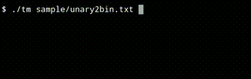

# turing-machine-simulator
A  simple Turing machine simulator with "stay-feature"


## Compile
```
$ cd /path_to_turing-machine-simulator/turing-machine-simulator/
$ make all
```
## Run
```
$ ./tm some_input_file.txt
```
## Run some existing samples
```
$ ./tm sample/unary2bin.txt
```
## Clean directory
```
make clean
```
## Syntax for writing your own program for Turing simulator
```
<input_string>
<present_state> <read_character> <write_character> <move_direction> <next_state>
<present_state> <read_character> <write_character> <move_direction> <next_state>
<present_state> <read_character> <write_character> <move_direction> <next_state>
.
.
.
[accept <state> [<state>...]]
```
input_string, present_state, next_state can be strings of any length. A string should not contain any whitespace in between.
read_character, write_character should be a single character.
move direction can be **l** (= left), **r** (= right), **s** (= stay).
accept takes the accepting states. It is optional and can be ignored.
## Example
```
aaaaabbbbb
q0 a x r q1
q1 a a r q1
q1 y y r q1
q1 b y l q2
q2 a a l q2
q2 y y l q2
q2 x x r q0
q0 y y r q3
q3 y y r q3
q3 _ _ l q4
accept q4 q3
```
